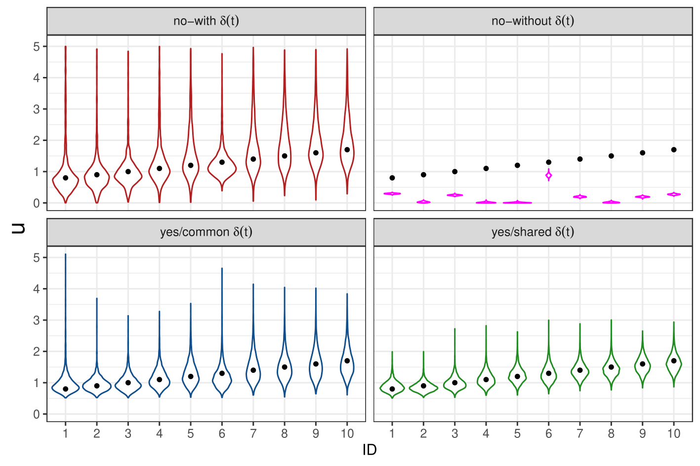
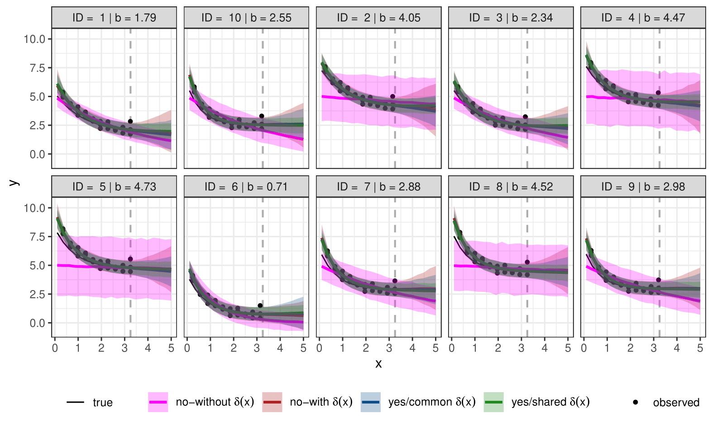

# Learning between Digital Twins with Low-Fidelity Models and Physics-Informed Gaussian Processes

This repository is the official implementation of the paper "Learning between Digital Twins with Low-Fidelity Models and Physics-Informed Gaussian Processes". 

<p align="center">
  
</p>

<p align="center">
Proposed method DAG (Directed Acyclic Graph)
</p>

## Requirements
The results can be reproduced in R (version 4.0.3).

To install required packages:

```setup
install.packages("rstan") 
install.packages("ggplot2")
install.packages("SAVE")
install.packages("latex2exp")
install.packages("ggpubr")
```

## Notebooks

The **Notebooks** folder contains the code to reproduce the results in the paper and appendix. 

More specifically:


- The **toy_paper_code.Rmd** contains the code of the results in Section 4.
- The **WK_simulation_study.Rmd** contains the code of the results in Section 5.2.
- The **WK_real_data.Rmd** contains the code of the results in Section 5.3.
- The **toy_appendix.Rmd** contains the code of the results in Appendix D.
- The **WK_appendix.Rmd** contains the code of the results in Appendix E.2.
- The **WK_real_predictions.Rmd** contains the code of the results in Section E.3.

All notebooks have also been exported as .pdf and .html files. 

Run time ranges from several minutes up to ~30 minutes.


## STAN
The **STAN** folder contains the stan code for the models in Sections 4, 5 and Appendix D and E.

More specifically:

- The **toy** folder contains the stan code for the models in Section 4 and Appendix D.
- The **WK2** folder contains the stan code for the models in Section 5.2 and Appendix E.2.
- The **WK2_periodic** folder contains the stan code for the models in Section 5.3 and Appendix E.3.

## Data
The **Data** folder contains blood flow data used to simulate blood pressures in Section 4. It contains also the posterior distribution samples of the models fitted in **WK_paper_code.Rmd**.


## Figs
The **Figs** folder contains the figures that can be exported by running the codes. To export the figures uncomment (remove #) before the ggsave functions in the codes.

## WK_numerical_simulators
The **WK_numerical_simulators** folder contains the WK3 numerical simulator used to simulate data for the experiments in Section 5.


## Results
Our modeling approach can learn the physical parameters of the more complex model but also reduce their posterior uncertainty. It also reduces the uncertainty in model predictions.

<p align="center">
  
  
</p>

<p align="center">
The models of the proposed methods are "yes/common delta" and "yes/shared delta"
</p>
